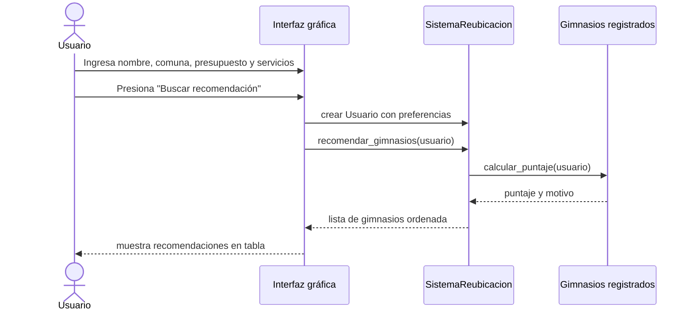

# Diagrama de secuencia

Caso de uso: Buscar recomendación de gimnasio.

```mermaid
sequenceDiagram
    actor Usuario
    participant Interfaz as Interfaz gráfica
    participant Sistema as SistemaReubicacion
    participant Gimnasio as Gimnasios registrados

    Usuario->>Interfaz: Ingresa nombre, comuna, presupuesto y servicios
    Usuario->>Interfaz: Presiona "Buscar recomendación"
    Interfaz->>Sistema: crear Usuario con preferencias
    Interfaz->>Sistema: recomendar_gimnasios(usuario)
    Sistema->>Gimnasio: calcular_puntaje(usuario)
    Gimnasio-->>Sistema: puntaje y motivo
    Sistema-->>Interfaz: lista de gimnasios ordenada
    Interfaz-->>Usuario: muestra recomendaciones en tabla
```
