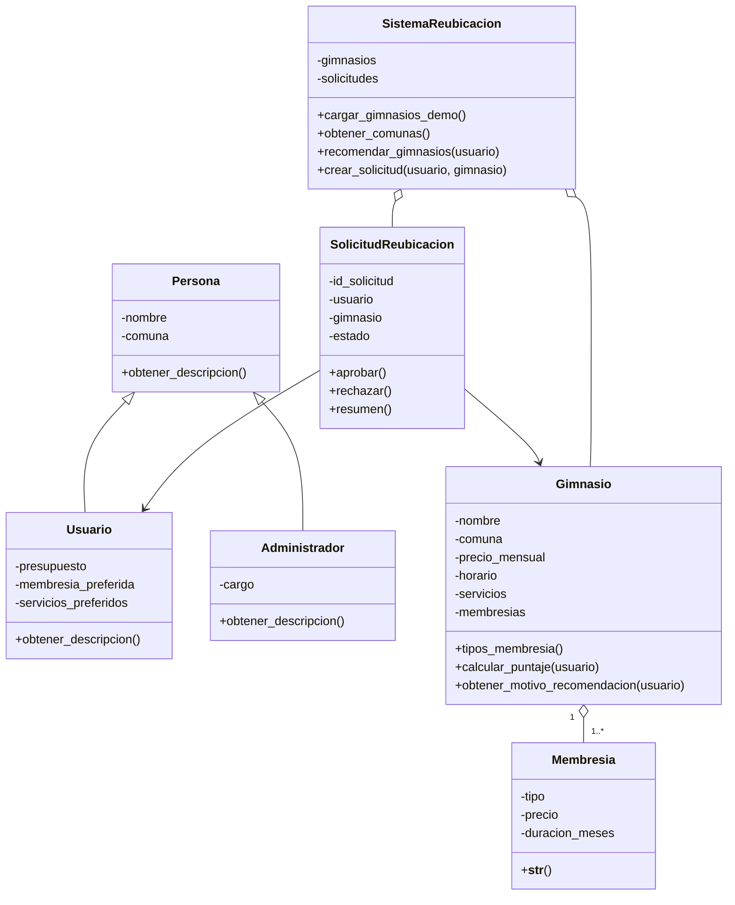

# Diagrama UML de clases

Este diagrama representa la estructura principal del sistema.

```mermaid
classDiagram
    class Persona {
        -nombre
        -comuna
        +obtener_descripcion()
    }

    class Usuario {
        -presupuesto
        -membresia_preferida
        -servicios_preferidos
        +obtener_descripcion()
    }

    class Administrador {
        -cargo
        +obtener_descripcion()
    }

    class Membresia {
        -tipo
        -precio
        -duracion_meses
        +__str__()
    }

    class Gimnasio {
        -nombre
        -comuna
        -precio_mensual
        -horario
        -servicios
        -membresias
        +tipos_membresia()
        +calcular_puntaje(usuario)
        +obtener_motivo_recomendacion(usuario)
    }

    class SolicitudReubicacion {
        -id_solicitud
        -usuario
        -gimnasio
        -estado
        +aprobar()
        +rechazar()
        +resumen()
    }

    class SistemaReubicacion {
        -gimnasios
        -solicitudes
        +cargar_gimnasios_demo()
        +obtener_comunas()
        +recomendar_gimnasios(usuario)
        +crear_solicitud(usuario, gimnasio)
    }

    Persona <|-- Usuario
    Persona <|-- Administrador
    Gimnasio "1" o-- "1..*" Membresia
    SolicitudReubicacion --> Usuario
    SolicitudReubicacion --> Gimnasio
    SistemaReubicacion o-- Gimnasio
    SistemaReubicacion o-- SolicitudReubicacion
```
